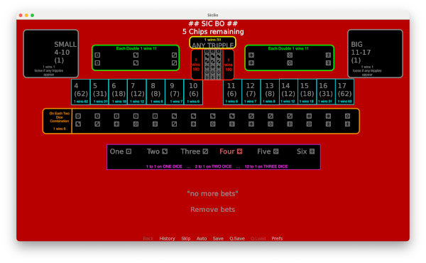

# SIC-BO #

Sic Bo, a gambling game where you predict which numbers appear on 3 dice. 
It has many betting options, and odds ranging from 180 to 1 for guessing a tripple, to 1 to 1 for guessing the number shown on one of the three dice.

Over a few days in August 2022 I coded up this version of the game in Ren'py.

The odds in this game were copied from Sydney's [Star Casino](https://www.star.com.au/sydney/sites/star.com.au.sydney/files/Sic_Bo_Game_Guide_Jan.pdf). The [Wikipedia page](https://en.wikipedia.org/wiki/Sic_bo) has different odds.

## To add this game to your Ren'py project ##
---

Feel free to add this game to your Ren'py project.

1. copy __sicbo.rpy__ to your game directory
2. In your renpy script 
    > call sicBoStar
    >
    > call placeBets
3. You may also wish to copy and use the background image: __bg sicboboard.png__